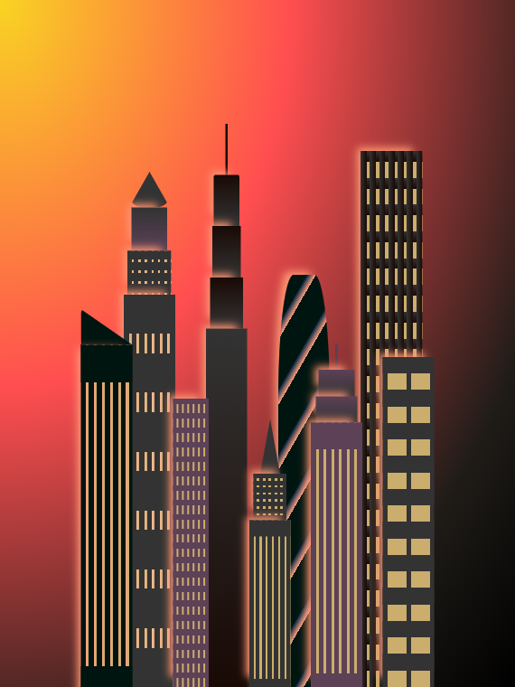
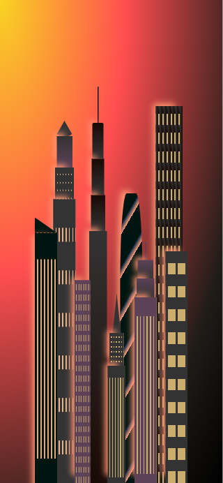

# A city skyline designed using CSS

## Screenshot

Here is an overview of the final result:

## Inspiration (I built this as part of freeCodeCamp's course)

## Desktop view (Redesigned the project )

## iPad view

## Mobile view

