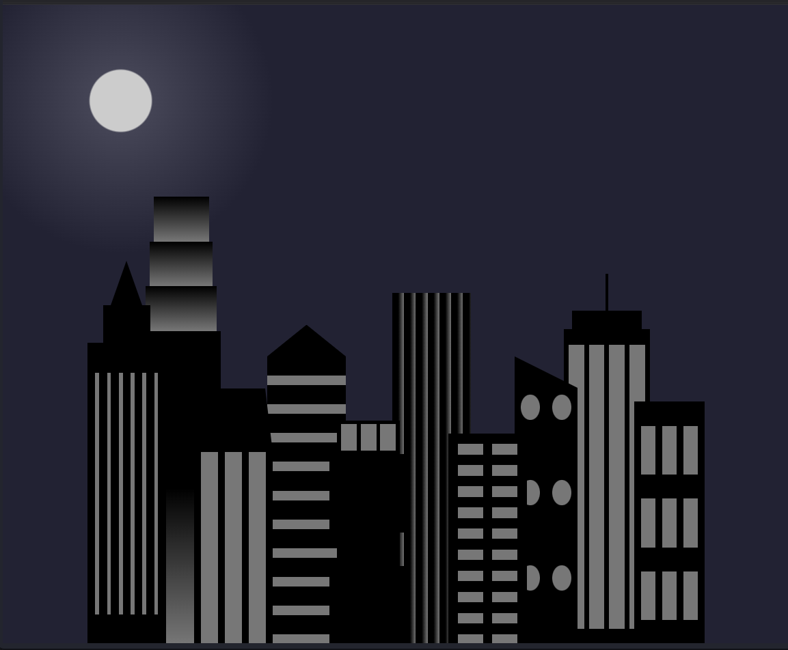
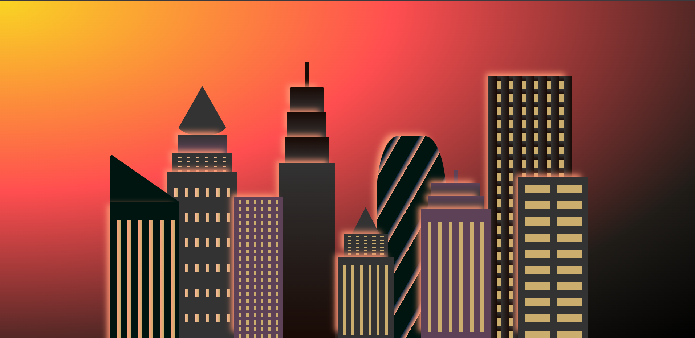

# A city skyline designed using CSS

Live link: <https://apocalyptic-city-skyline.vercel.app/>

## Inspiration (I built this as part of freeCodeCamp's course)

Here is an overview of my re-designed version of the city skyline:

## Desktop view

## iPad view

## Mobile view

